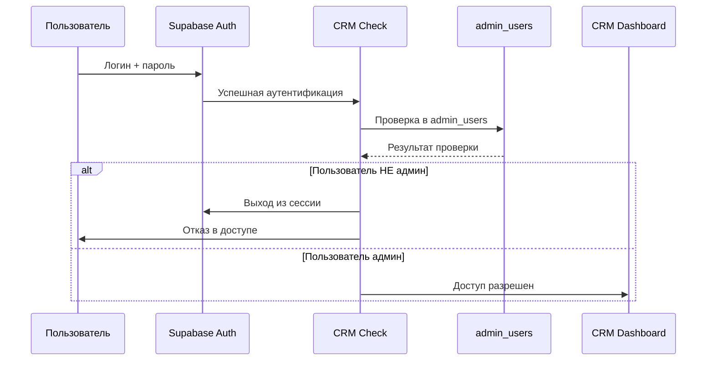

# 🔐 Руководство по настройке безопасной авторизации CRM

**Дата создания:** 21.06.2025  
**Статус:** Готово к применению  
**Приоритет:** КРИТИЧЕСКИЙ - Безопасность

## 📋 Обзор изменений

### Проблема
Ранее любой пользователь основного приложения Spody мог войти в CRM панель, что создавало серьезную угрозу безопасности.

### Решение
Создана система ролевой авторизации с отдельной таблицей `admin_users`, которая контролирует доступ к CRM.

## 🚀 Пошаговая инструкция

### Шаг 1: Выполнение SQL миграции

1. **Откройте Supabase Dashboard**
   - Перейдите на [supabase.com](https://supabase.com)
   - Войдите в проект Spody

2. **Откройте SQL Editor**
   - В левом меню выберите "SQL Editor"
   - Нажмите "New query"

3. **Выполните миграцию**
   - Скопируйте содержимое файла `CRM_ADMIN_USERS_MIGRATION.sql`
   - Вставьте в SQL Editor
   - Нажмите "Run"

### Шаг 2: Добавление первого администратора

1. **Найдите ваш User ID**
   ```sql
   SELECT id, email FROM auth.users WHERE email = 'ваш-email@example.com';
   ```

2. **Добавьте себя как супер-админа**
   ```sql
   INSERT INTO public.admin_users (user_id, email, role, is_active, created_by)
   SELECT 
     id as user_id,
     email,
     'super_admin' as role,
     true as is_active,
     id as created_by
   FROM auth.users 
   WHERE email = 'ваш-email@example.com'  -- ЗАМЕНИТЕ НА ВАШ EMAIL
   ON CONFLICT (email) DO NOTHING;
   ```

3. **Проверьте результат**
   ```sql
   SELECT * FROM public.admin_users;
   ```

### Шаг 3: Тестирование системы

1. **Выйдите из CRM** (если вы вошли)
2. **Попробуйте войти** с аккаунтом основного приложения
   - Должен появиться отказ: "Доступ запрещен. Только администраторы могут войти в CRM."
3. **Войдите с админским аккаунтом**
   - Должен быть разрешен доступ

### Шаг 4: Управление администраторами

1. **Перейдите в CRM** → `/admin-users`
2. **Используйте интерфейс** для добавления новых администраторов
3. **Добавляйте только доверенных пользователей**

## 🔧 Техническая документация

### Структура таблицы admin_users

```sql
CREATE TABLE public.admin_users (
  id UUID PRIMARY KEY,                    -- Уникальный ID записи
  user_id UUID REFERENCES auth.users,    -- Ссылка на пользователя Supabase
  email VARCHAR(255) UNIQUE,             -- Email администратора
  role VARCHAR(50) DEFAULT 'admin',      -- Роль (admin, super_admin)
  is_active BOOLEAN DEFAULT true,        -- Активность аккаунта
  created_at TIMESTAMP DEFAULT NOW(),    -- Дата создания
  updated_at TIMESTAMP DEFAULT NOW(),    -- Дата обновления
  created_by UUID REFERENCES auth.users  -- Кто добавил админа
);
```

### Логика авторизации



### Безопасность

1. **Row Level Security (RLS)**
   - Включена на таблице `admin_users`
   - Только админы могут управлять админами

2. **Автоматический выход**
   - При отказе в доступе пользователь автоматически выходит из Supabase сессии

3. **Валидация**
   - Проверка существования пользователя в Supabase Auth
   - Проверка активности аккаунта админа

## 🎯 Роли администраторов

### `admin` (Обычный админ)
- Доступ ко всем функциям CRM
- Может управлять моделями и контентом
- НЕ может добавлять других админов

### `super_admin` (Супер-админ)
- Все права обычного админа
- Может добавлять/удалять других администраторов
- Полный доступ к системным настройкам

## 🚨 Важные замечания

### Демо-аккаунт
Демо-аккаунт `admin@spody.app` / `admin123` продолжает работать для тестирования.

### Резервный доступ
В случае блокировки всех админов, можно:
1. Использовать демо-аккаунт для доступа
2. Добавить нового админа через SQL в Supabase
3. Восстановить доступ через service_role ключ

### Мониторинг
Рекомендуется регулярно проверять:
- Список активных администраторов
- Логи входов в систему
- Подозрительную активность

## 📊 Статус внедрения

- ✅ **Код обновлен** - все файлы изменены
- ✅ **Миграция создана** - готова к выполнению
- ✅ **Интерфейс готов** - страница `/admin-users`
- ✅ **Документация** - полное руководство
- ⚠️ **Требует выполнения** - миграция в Supabase

## 🔄 Следующие шаги

1. **Выполнить миграцию** в Supabase (Шаг 1-2)
2. **Протестировать систему** (Шаг 3)
3. **Добавить необходимых админов** (Шаг 4)
4. **Обновить Memory Bank** после успешного внедрения

---

**Контакт:** При возникновении проблем обращайтесь к Memory Bank или документации проекта. 